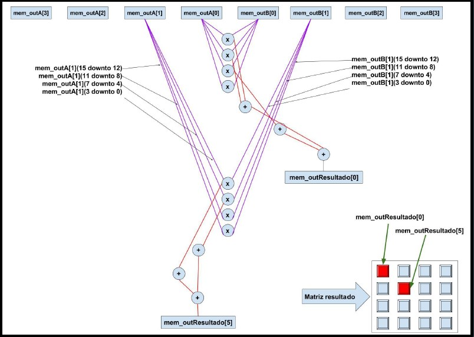
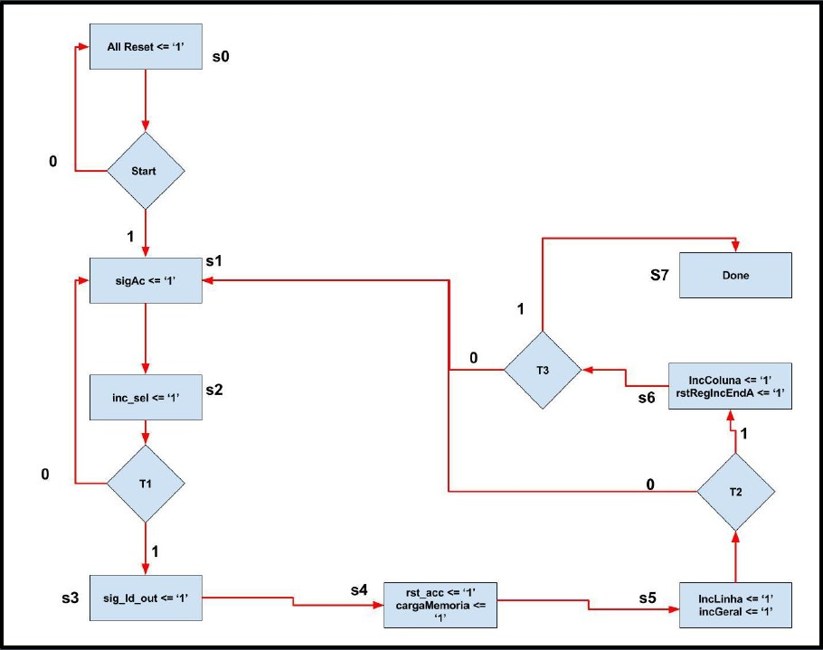
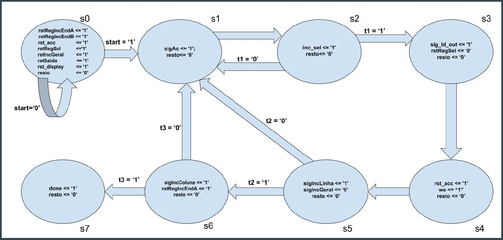
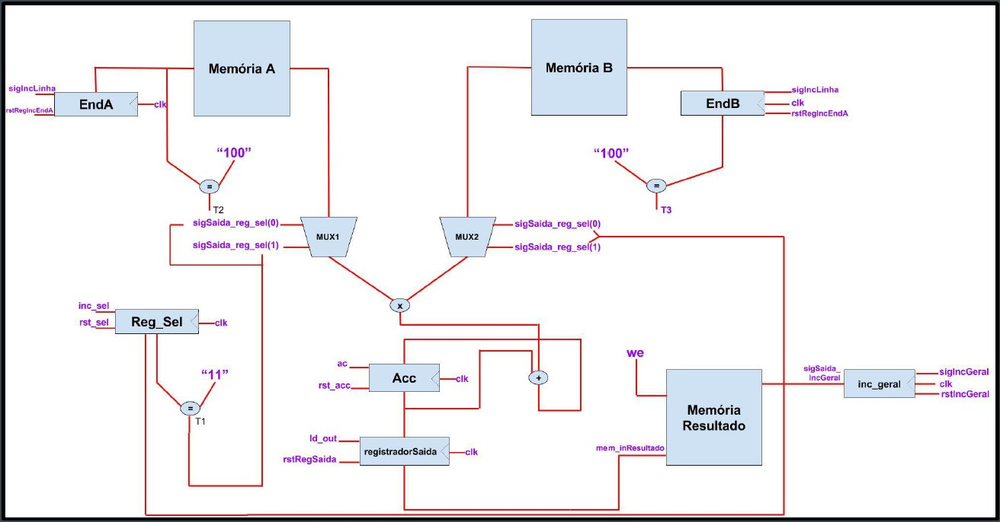
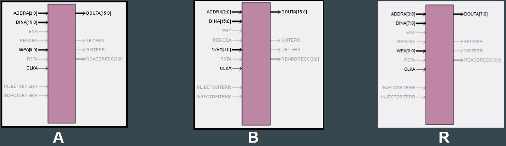
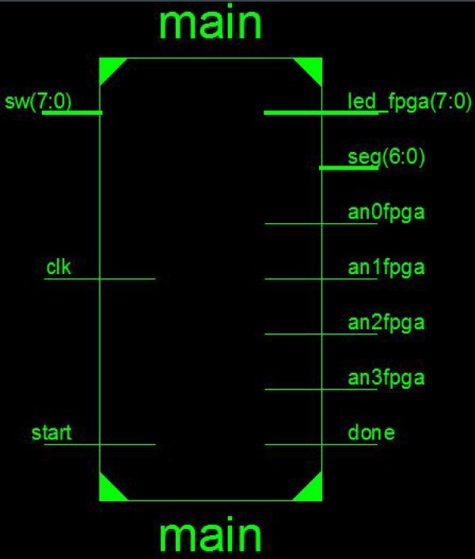
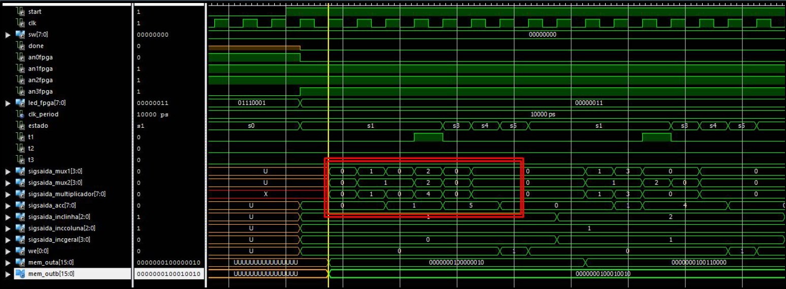
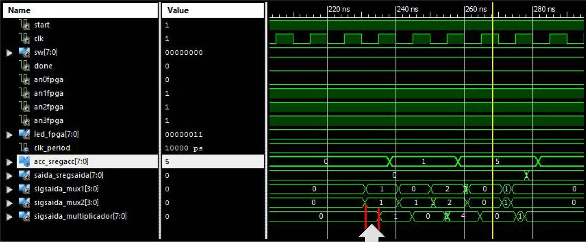
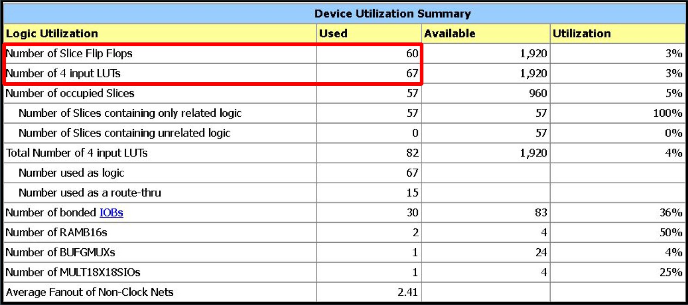

# 4x4-Multiplier-VHDL-
__Authors:__ Eduardo Brito, Felipe Tormes, Levindo Neto

A 4x4 Multiplier made in VHDL.

## Algorithmic 
The used algorithmic can be viewed in the image below:

## RTL Project
The RTL Project is divided in: 
* ASM Fluxogram
* Control Block (FSM)
* Operative Block (Registers, Logical, Functional and Arithmetic Circuits)

### ASM Fluxogram
The ASM fluxogram for the modelling of the RTL project can be viewed in the following image:

### Control Block
The finite state machine for the 4x4 Multiplier can be viewed in the image below:

### Operative Block
The operative part, with the registers, logical, function and arithmetic digital blocks, can be viewed in the image below:

## Memory Organization
The memory of the 4x4 multiplier is divided in:
* Two single-port memories with 4 positions of 16 bits each for the input matrices.
* One single-port memory with 16 positions of 8 bits each for the output matrix.
The organization of the used memory can be viewed in the following image:

## High Level Circuit
The high level circuit can be viewed in the image below:

## Temporal Simulations
### Simulation Without Delay

### Simulation with Delay

## Informations

### Area Informations

### Temporal Informations
__Number of Cycles:__ 154. 
__Time to answer:__ 1535ns using 10 ns of period. 
__Minimum period:__ 10.233ns. 
__Maximum Frequency:__ 97.723MHz. 
__Minimum input arrival time before clock:__ 2.382ns. 
__Maximum output required time after clock:__ 6.446ns. 
